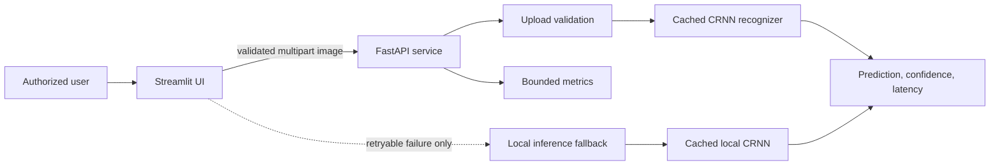
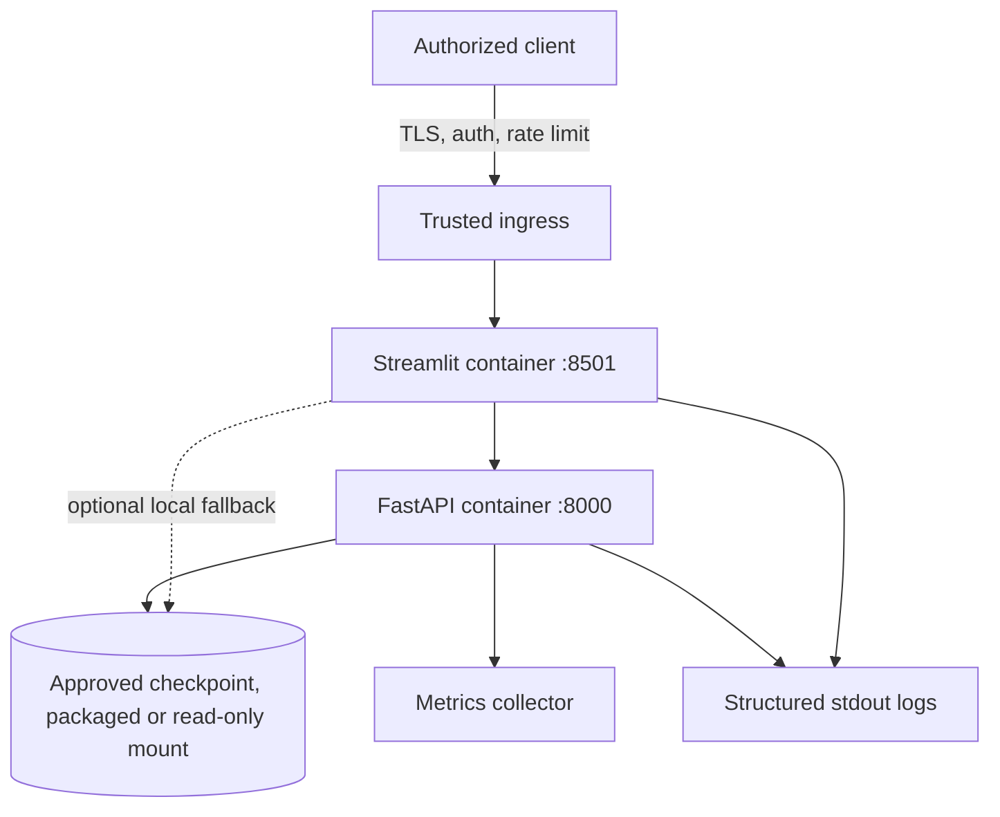

# CipherLens

<p align="center">
  
</p>

<p align="center">
  Production-oriented OCR for fixed-length, authorized CAPTCHA-style images.
</p>

<p align="center">
  <a href="https://github.com/priyanshu141ai/Captcha-Detection-pro/actions/workflows/ci.yml"></a>
  
  
</p>

CipherLens recognizes six-character text in synthetic, owned, or explicitly
authorized CAPTCHA-style images. It combines a compact PyTorch CRNN, a typed
FastAPI inference service, a Streamlit frontend, reproducible dataset and
evaluation tooling, and a hardened CPU-only container deployment.

> **Ethical use:** Do not use CipherLens to automate third-party CAPTCHA
> submission, bypass access controls, or interact with systems you do not own or
> have explicit permission to test. The project intentionally contains no browser
> automation or external-site integration.

## Problem statement

The input is a noisy 151 x 41 RGB image containing exactly six mixed-case
alphanumeric characters. The system must recover the full string without manual
character segmentation, remain practical on CPU, and expose enough evidence to
distinguish a working demo from a trustworthy model release.

The main constraint is data, not model size: the repository contains 1,000
labelled development images, several rare characters, incomplete source
provenance, and no independent external-test split.

## Architecture



The shared preprocessing path converts to RGB, resizes to 176 x 48, normalizes
pixels to `[-1, 1]`, and feeds four convolution blocks followed by a bidirectional
LSTM. Six position-wise outputs are greedily decoded with the checkpoint
vocabulary. Training, evaluation, serving, and presentation remain separate.

See [Architecture](docs/architecture.md) for component boundaries, data flows,
failure behavior, deployment, and design decisions.

## Dataset

| Property | Current value |
|---|---:|
| Authorized development images | 1,000 |
| Source batches | 2 x 500 |
| Image contract | 151 x 41 RGB-compatible |
| Label contract | 6 characters |
| Deterministic split | 800 train / 200 validation |
| Observed classes | 43 |
| External-test samples | 0 |

`python -m scripts.audit_dataset` validates image decoding, dimensions, labels,
vocabulary, exact hashes, perceptual near-duplicates, repeated labels, split
leakage, and source containment. It never deletes suspicious files. Related
samples are grouped before deterministic splitting.

Full provenance, authorization gaps, hashes, rare/unseen characters, and split
roles are recorded in the [Dataset Card](docs/dataset-card.md).

## Results

The committed Model V1 evaluation covers the 200-row validation manifest only.
The legacy checkpoint does not contain enough training-split metadata to rule out
historical overlap, so these numbers are **provisional diagnostics**, not external
generalization or promotion evidence.

| Metric | Model V1 validation result |
|---|---:|
| Character accuracy | 98.5833% |
| Exact-string accuracy | 92.0000% |
| Character error rate | 1.4167% |
| Normalized edit distance | 0.014167 |
| Sequence ECE | 0.037364 |
| Median CPU model-forward latency | 4.486 ms |
| Parameters | 1,190,475 |
| Checkpoint size | 4.56 MiB |

Latency is a warmed-up, single-sample model forward pass and excludes decode and
preprocessing. External evaluation and independent calibration remain pending.
See the [Model Card](docs/model-card.md) and
[Model Comparison](docs/model-comparison.md).

### Error-analysis examples

All 16 failed validation strings are exported to
[`reports/evaluation/failed_predictions.csv`](reports/evaluation/failed_predictions.csv).
Representative errors show why exact-string accuracy is stricter than character
accuracy:

| Target | Prediction | Observed error |
|---|---|---|
| `p3FZWQ` | `P3FZWQ` | Upper/lower-case confusion at position 1 |
| `TG3R68` | `TG3RB8` | `6` confused with `B` at position 5 |
| `RbRLGH` | `RbRL6H` | `G` confused with `6` at position 5 |
| `eTPNCC` | `eTpNCc` | Two upper/lower-case confusions |

The [confusion matrix](reports/figures/confusion_matrix.png) and
[reliability diagram](reports/figures/reliability_diagram.png) provide the full
static analysis.

## Current limitations

- Output is fixed at six characters and limited to the checkpoint vocabulary.
- Dataset generation, collection date, and independent license evidence are not
  fully documented.
- No authorized, independently sourced external-test or calibration split exists.
- Legacy checkpoint split provenance makes current validation evidence provisional.
- Rare and unseen classes limit robustness on new generators or visual styles.
- Confidence is a review signal, not a universal probability of correctness.
- Metrics are process-local; production aggregation, alerting, TLS, authentication,
  and rate limiting belong at the deployment platform or trusted ingress.

## Installation

Requirements: Python 3.11 and a PowerShell terminal at the repository root.

```powershell
python -m venv .venv
.\.venv\Scripts\Activate.ps1
python -m pip install --upgrade pip
python -m pip install --editable ".[dev]"
```

Runtime-only installation:

```powershell
python -m pip install --editable .
```

Validated defaults live in `configs/default.yaml`; environment variables override
them at startup. Copy `.env.example` to `.env` only for local Compose overrides,
and never commit `.env` or secrets. The complete variable reference is in the
[Operations Guide](docs/operations.md#runtime-configuration).

## Training

Audit the dataset first, then write only to a candidate artifact:

```powershell
python -m scripts.audit_dataset
python train.py `
  --extra-dataset requirements2.txt data/batch_1 `
  --output models/captcha_crnn_candidate.pt `
  --history-output artifacts/candidate-training-history.json
```

Training supports YAML defaults, CLI overrides, deterministic seeds,
coverage-aware manifests, augmentation, class weighting, AdamW, scheduling,
gradient clipping, early stopping, safe resume checkpoints, and optional MLflow.
It refuses to overwrite `models/captcha_crnn.pt` during routine training.

```powershell
python train.py --resume-checkpoint artifacts/candidate-training-resume.pt
python -m pip install --editable ".[tracking]"
python train.py --mlflow --mlflow-experiment CipherLens
```

Do not promote a candidate without aligned external evidence and explicit review.

## Evaluation

```powershell
python -m scripts.evaluate_model
python -m scripts.compare_models
```

Evaluation verifies manifest paths, hashes, labels, dataset version, and
checkpoint identity before reporting character/exact accuracy, CER, normalized
edit distance, per-position and per-character metrics, failures, latency,
calibration, and figures. Optional temperature scaling is validation-only:

```powershell
python -m scripts.evaluate_model --temperature-scale
```

When an external set is unavailable, the evaluator reports `pending` instead of
inventing a value.

## FastAPI usage

```powershell
python -m uvicorn cipherlens.api:app --host 127.0.0.1 --port 8000
```

OpenAPI is available at `http://127.0.0.1:8000/docs`.

```powershell
curl.exe -X POST http://127.0.0.1:8000/predict `
  -F "file=@data/batch_0/captcha_00000.png;type=image/png"
```

| Endpoint | Purpose |
|---|---|
| `GET /health` | Process liveness |
| `GET /ready` | Model readiness |
| `GET /model-info` | Architecture and checkpoint contract |
| `POST /predict` | One validated image |
| `POST /predict/batch` | Bounded image batch |
| `GET /metrics` | Prometheus-compatible process metrics |

Responses include predicted text, overall and per-character confidence, model
version, inference time, and request ID. Uploaded bytes are processed in memory
and are neither logged nor deliberately persisted.

## Streamlit usage

Start the API, then run:

```powershell
python -m streamlit run app.py
```

Open `http://127.0.0.1:8501`. The frontend validates PNG/JPEG uploads before
calling FastAPI, displays confidence, latency, model version, and serving path,
and handles structured backend errors. A configurable local fallback is used only
for retryable API/network failures; HTTP 4xx validation failures do not fall back.

## Docker usage

```powershell
docker compose up --build --detach --wait
docker compose ps
```

- Streamlit: `http://127.0.0.1:8501`
- FastAPI/OpenAPI: `http://127.0.0.1:8000/docs`

Both services share a multi-stage CPU-only image and run as UID/GID 10001 with a
read-only root filesystem, bounded `/tmp`, dropped capabilities, health checks,
and resource limits. For a read-only deployment-managed checkpoint:

```powershell
$env:CIPHERLENS_MODEL_HOST_PATH = "C:/models/approved/captcha-crnn-v1.pt"
docker compose -f compose.yaml -f compose.model-mount.yaml `
  up --build --detach --wait
```

See [Operations](docs/operations.md) for model packaging, promotion, rollback,
scaling, security, and failure recovery.

## Testing

```powershell
python -m compileall -q app.py train.py src tests scripts
python -m ruff format --check .
python -m ruff check .
python -m mypy
python -m coverage erase
python -m coverage run -m unittest discover -s tests -v
python -m coverage report
python -m scripts.verify_runtime
python -m pip check
docker compose config
```

CI repeats linting, typing, generated-fixture unit/integration tests, an 85%
branch-coverage gate, approved-artifact compatibility checks when available, and
a running-container security smoke test.

## Reproducibility

1. Use Python 3.11 and the pinned runtime dependencies.
2. Run `python -m scripts.audit_dataset` and record the dataset/split hashes.
3. Train from the versioned manifest with an explicit seed and candidate path.
4. Retain checkpoint metadata: architecture, vocabulary, preprocessing, dataset,
   configuration, validation metrics, Git commit, and creation time.
5. Evaluate the exact checkpoint and manifest; keep validation, calibration, and
   external-test roles separate.
6. Record the checkpoint SHA-256 and immutable image digest during promotion.

## Deployment architecture



Compose provides the application baseline; a production platform must provide
TLS termination, access control, centralized logs/metrics, alerting, backups, and
artifact/image provenance.

## Repository map

```text
src/cipherlens/
|-- api/          # FastAPI routes, schemas, upload boundary
|-- data/         # audit, manifests, preprocessing
|-- evaluation/   # metrics, calibration, reports, comparison
|-- inference/    # checkpoint loading, client, prediction
|-- models/       # position-wise and experimental CTC models
|-- monitoring/   # bounded process metrics
|-- training/     # data, engine, checkpoint, optional tracking
`-- utils/        # reproducibility helpers
```

Compatibility modules under `src/` preserve existing `src.*` imports while new
code uses the installable `cipherlens` package.

## Documentation

| Document | Purpose |
|---|---|
| [Architecture](docs/architecture.md) | Components, data flows, trust boundaries, decisions |
| [Dataset Card](docs/dataset-card.md) | Provenance, authorization, splits, quality |
| [Model Card](docs/model-card.md) | Evidence, runtime, calibration, limitations |
| [Operations](docs/operations.md) | Deployment, configuration, promotion, rollback |
| [Interview Story](docs/interview-story.md) | Concise engineering narrative and trade-offs |
| [Technical Reference](docs/TECHNICAL_DOCUMENTATION.md) | Detailed implementation and CLI contracts |
| [Upgrade Audit](docs/upgrade-audit.md) | Original evidence-based modernization plan |

## Future improvements

- Collect a separately sourced, authorized external-test and calibration set.
- Record generator, license, collection date, and family metadata for every sample.
- Add targeted examples for rare/unseen characters and generator families.
- Run repeated, aligned V1/V2 training experiments and ablations before promotion.
- Add deployment-level tracing, metrics aggregation, alerting, artifact signing,
  image scanning, TLS, authentication, and rate limiting.
- Consider variable-length decoding or transformer OCR only when data and measured
  evidence justify the added complexity.

CipherLens is an educational recognition system for authorized data—not an
access-control bypass tool.
