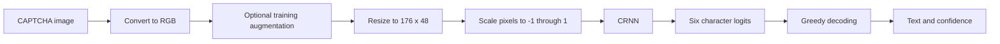
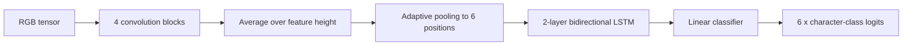

# CipherLens Technical Documentation

## 1. Overview

CipherLens is a local CAPTCHA recognition system for fixed-length, six-character CAPTCHA images. It contains:

- a PyTorch training pipeline;
- a compact convolutional recurrent neural network (CRNN);
- checkpoint-based inference;
- a Streamlit upload and recognition interface;
- automated regression tests.

The current dataset contains 1,000 labeled PNG images across two batches. Each source image is 151 by 41 pixels, and each label contains exactly six characters. The trained model recognizes the 43 characters observed across both batches.

## 2. Repository structure

```text
Captcha-Detection/
|-- .streamlit/
|   `-- config.toml              # Streamlit theme and upload configuration
|-- assets/
|   `-- cipherlens-mark.png      # Application logo
|-- data/
|   |-- batch_0/                 # 500 CAPTCHA PNG images
|   `-- batch_1/                 # 500 additional CAPTCHA PNG images
|-- design/
|   `-- cipherlens-concept.png   # UI design reference
|-- docs/
|   `-- TECHNICAL_DOCUMENTATION.md
|-- models/
|   `-- captcha_crnn.pt          # Trained model checkpoint
|-- configs/
|   `-- default.yaml             # Validated application and training defaults
|-- src/
|   |-- cipherlens/              # Installable application package
|   |   |-- data/                # Dataset loading, splitting, and preprocessing
|   |   |-- inference/           # Checkpoint inference and upload validation
|   |   |-- models/              # Network, codec, and edit-distance logic
|   |   `-- utils/               # Reproducibility helpers
|   |-- data.py                  # Legacy compatibility import
|   |-- inference.py             # Legacy compatibility import
|   `-- model.py                 # Legacy compatibility import
|-- tests/
|   `-- test_core.py             # Core regression tests
|-- app.py                       # Streamlit application
|-- labels.txt                   # Image filename-to-label mapping
|-- requirements2.txt            # Batch 1 filename-to-label mapping
|-- requirements.txt             # Runtime Python dependencies
`-- train.py                     # Training and validation entry point
```

## 3. Runtime requirements

- Python 3.11 or a compatible Python 3 version
- PyTorch
- Streamlit
- Pillow
- NumPy

Install the exact project dependencies into a virtual environment:

```powershell
python -m venv .venv
.\.venv\Scripts\Activate.ps1
python -m pip install --editable ".[dev]"
```

On macOS or Linux, activate the environment with:

```bash
source .venv/bin/activate
```

## 4. Dataset contract

### 4.1 Image directory

Training images are stored in `data/batch_0` and `data/batch_1`. The default training command uses batch 0; pass `--extra-dataset requirements2.txt data/batch_1` to include batch 1.

Current source-image properties:

| Property | Value |
|---|---:|
| Image count | 1,000 |
| Width | 151 pixels |
| Height | 41 pixels |
| Color input | RGB |
| Label length | 6 characters |
| Observed character classes | 43 |

### 4.2 Label file

`labels.txt` and `requirements2.txt` use one whitespace-separated filename and label per line:

```text
captcha_00000.png TAGbCN
captcha_00001.png rrAZHS
captcha_00002.png G3HPAM
```

`load_samples()` validates that:

- every non-empty row has exactly two fields;
- every referenced image exists;
- at least one valid sample is loaded.

Malformed rows raise `ValueError`. Missing images raise `FileNotFoundError`.

### 4.3 Character set

The model character set is not hard-coded. `observed_charset()` collects and sorts every unique character found in the loaded labels. The character set is stored in the trained checkpoint and reconstructed during inference.

Consequences:

- the model cannot predict characters absent from the training labels;
- adding new character classes requires retraining;
- checkpoint and classifier dimensions always remain consistent.

## 5. Processing pipeline



### 5.1 Image preprocessing

`prepare_image()` performs the shared training and inference preprocessing:

1. Converts the image to RGB.
2. Applies augmentation only when `augment=True`.
3. Resizes the image to 176 by 48 pixels.
4. Converts pixels to a channel-first PyTorch tensor.
5. Normalizes values from `[0, 1]` to `[-1, 1]`.

The output shape for one image is:

```text
[channels, height, width] = [3, 48, 176]
```

### 5.2 Training augmentation

The training dataset applies restrained random augmentation:

- rotation from -3 to +3 degrees;
- horizontal translation from -3 to +3 pixels;
- vertical translation from -2 to +2 pixels;
- contrast multiplier from 0.82 to 1.20;
- brightness multiplier from 0.90 to 1.08;
- occasional Gaussian blur;
- occasional Gaussian tensor noise.

Validation and inference do not apply augmentation.

### 5.3 Coverage-aware split

`coverage_aware_split()` creates a deterministic training/validation split while keeping at least one occurrence of every observed character in the training subset.

Combined-batch checkpoint behavior:

- seed: `42`;
- validation fraction: `0.2`;
- training samples: `800`;
- validation samples: `200`.

Training only the default batch 0 dataset produces a 400/100 split.

This protects rare characters from being placed only in validation. It does not solve severe class imbalance; more examples are still required for reliable generalization.

## 6. Model architecture

The model is implemented by `CaptchaCRNN` in `src/cipherlens/models/__init__.py`.
`src/model.py` remains as a backward-compatible import surface.



### 6.1 Default model configuration

| Field | Default | Purpose |
|---|---:|---|
| `image_height` | 48 | Resized input height |
| `image_width` | 176 | Resized input width |
| `hidden_size` | 128 | Hidden units in each LSTM direction |
| `lstm_layers` | 2 | Number of recurrent layers |
| `sequence_length` | 6 | Number of output character positions |

### 6.2 Convolutional feature extractor

Each `ConvBlock` contains:

```text
Conv2d -> BatchNorm2d -> ReLU -> MaxPool2d
```

Tensor dimensions through the default network are:

| Stage | Output shape |
|---|---|
| Input | `[batch, 3, 48, 176]` |
| Convolution block 1 | `[batch, 32, 24, 88]` |
| Convolution block 2 | `[batch, 64, 12, 44]` |
| Convolution block 3 | `[batch, 128, 6, 44]` |
| Convolution block 4 | `[batch, 256, 3, 44]` |
| Height average | `[batch, 256, 44]` |
| Adaptive width pooling | `[batch, 256, 6]` |
| Sequence permutation | `[6, batch, 256]` |
| Bidirectional LSTM | `[6, batch, 256]` |
| Classifier | `[6, batch, character_classes]` |

The network contains approximately 1.19 million parameters with the current configuration.

### 6.3 Why position-wise classification is used

All supplied CAPTCHA labels have exactly six characters. The network therefore produces one classification result for each of six horizontal sequence positions.

This design was selected because it:

- is simpler to optimize than CTC on the 1,000-image dataset;
- preserves repeated characters such as `AAAAAA` without blank-token logic;
- uses bidirectional sequence context to resolve noisy or overlapping characters;
- is substantially smaller than transformer OCR architectures.

The architecture must be changed for variable-length CAPTCHA strings. A CTC or attention-based decoder is more appropriate when output length is unknown.

## 7. Character encoding and decoding

`CaptchaCodec` maps each character to a zero-based class index.

### Encoding

```python
codec = CaptchaCodec("ABC123")
target = codec.encode("A1C2B3")
```

An unknown label character raises `ValueError`.

### Decoding

`greedy_decode()` performs these operations:

1. Applies softmax across character classes.
2. Selects the highest-probability class at each of six positions.
3. Converts class indices back to characters.
4. Computes an image-level confidence score.

Confidence is the geometric mean of the six selected character probabilities:

```text
confidence = exp(mean(log(character_probability)))
```

This confidence is useful for ranking predictions, but it is not statistically calibrated.

## 8. Training pipeline

Run the default training configuration from the project root:

```powershell
python train.py
```

Training performs the following sequence:

1. Seeds Python, NumPy, and PyTorch.
2. Selects CPU or CUDA.
3. Loads and validates labels and images.
4. Builds the observed character set.
5. Creates a coverage-aware split.
6. Creates augmented training and unaugmented validation loaders.
7. Builds the CRNN.
8. Calculates class weights from training-character frequencies.
9. Optimizes with AdamW.
10. Reduces the learning rate when validation loss stalls.
11. Clips gradients to a maximum norm of `5.0`.
12. Atomically saves the checkpoint with the best character accuracy, using
    exact accuracy and validation loss as tie-breakers.
13. Stops early when validation character accuracy no longer improves.

### 8.1 Command-line arguments

| Argument | Default | Description |
|---|---|---|
| `--labels` | `labels.txt` | Label mapping file |
| `--images` | `data/batch_0` | CAPTCHA image directory |
| `--extra-dataset LABELS IMAGES` | none | Additional label file and image directory; repeatable |
| `--output` | `models/captcha_crnn.pt` | Checkpoint output path |
| `--init-checkpoint` | none | Warm-start weights and shared character classifiers |
| `--epochs` | `60` | Maximum training epochs |
| `--batch-size` | `32` | Samples per optimizer step |
| `--learning-rate` | `0.001` | Initial AdamW learning rate |
| `--validation-fraction` | `0.2` | Fraction reserved for validation |
| `--patience` | `15` | Early-stopping patience |
| `--seed` | `42` | Reproducibility seed |
| `--device` | `auto` | `auto`, `cpu`, or `cuda` |
| `--num-workers` | `0` | DataLoader worker processes |
| `--torch-threads` | up to `4` | Maximum CPU threads used by PyTorch |
| `--no-cache-images` | disabled | Read images from disk on every epoch |
| `--history-output` | `training_history.json` | JSON metric-history path |
| `--config` | `configs/default.yaml` | YAML defaults file |
| `--deterministic` | disabled | Request deterministic PyTorch algorithms |
| `--log-level` | `INFO` | Structured logging level |
| `--log-format` | `console` | `console` or `json` logging |

Example custom run:

```powershell
python train.py --epochs 80 --batch-size 32 --learning-rate 0.0005 --device cpu
```

Train on batch 0 and batch 1 together:

```powershell
python train.py --extra-dataset requirements2.txt data/batch_1
```

The default `--labels` and `--images` dataset is always loaded first. Each
`--extra-dataset` pair is then appended. Duplicate resolved image paths are
rejected to prevent accidentally training on the same files twice.

When `--init-checkpoint` is provided, convolutional and recurrent weights are
restored from that checkpoint. Classifier rows are copied by character name,
so shared characters retain their learned weights while newly observed
characters start with random classifier weights. Model configurations must
match.

### 8.2 Loss and class weighting

Training uses weighted cross-entropy across the six character positions. Character weights are based on inverse square-root frequency and capped at `4.0` before normalization.

This reduces domination by common characters while preventing extremely rare classes from receiving unstable, unbounded weights.

### 8.3 Optimizer and scheduler

| Component | Configuration |
|---|---|
| Optimizer | AdamW |
| Weight decay | `0.0001` |
| Scheduler | ReduceLROnPlateau |
| Scheduler factor | `0.5` |
| Scheduler patience | `4` epochs |
| Gradient clipping | Maximum norm `5.0` |

### 8.4 Validation metrics

The training loop reports:

- `train_loss`: mean weighted training loss;
- `val_loss`: mean weighted validation loss;
- `character_accuracy`: one minus total Levenshtein distance divided by total label characters;
- `exact_accuracy`: fraction of complete six-character strings predicted correctly.

The included checkpoint achieved:

| Metric | Result |
|---|---:|
| Character accuracy | 98.58% |
| Exact-string accuracy | 92% |
| Selected fine-tuning epoch | 9 |

These metrics apply to the deterministic split of the supplied dataset and should not be treated as broad real-world CAPTCHA performance.

## 9. Checkpoint format

The checkpoint at `models/captcha_crnn.pt` is a PyTorch dictionary:

```python
{
    "model_state": ...,       # Model state_dict
    "charset": ...,           # Ordered training character set
    "model_config": ...,      # Serialized ModelConfig fields
    "metrics": ...,           # Best validation metrics
    "epoch": ...,             # Selected epoch number
}
```

Inference and warm-start loading use PyTorch's restricted `weights_only=True`
mode and validate required checkpoint fields. Checkpoints should still come only
from trusted build or artifact pipelines.

## 10. Inference API

`CaptchaRecognizer` provides the reusable Python inference interface.

```python
from PIL import Image

from src.inference import CaptchaRecognizer

recognizer = CaptchaRecognizer("models/captcha_crnn.pt")

with Image.open("data/batch_0/captcha_00000.png") as image:
    prediction = recognizer.predict(image)

print(prediction.text)
print(prediction.confidence)
```

The returned `Prediction` dataclass contains:

| Field | Type | Description |
|---|---|---|
| `text` | `str` | Six decoded characters |
| `confidence` | `float` | Geometric-mean confidence from 0 to 1 |

The default inference device is CPU. To use CUDA:

```python
recognizer = CaptchaRecognizer("models/captcha_crnn.pt", device="cuda")
```

CUDA inference requires a compatible PyTorch installation and GPU.

## 11. Streamlit application

Start the UI from the project root:

```powershell
streamlit run app.py
```

Open `http://localhost:8501`.

### Application flow

1. The user uploads a PNG, JPG, or JPEG image.
2. The application validates format, byte size, decoded pixel count, and image
   integrity before previewing it.
3. The user selects **Recognize text**.
4. The cached recognizer loads `models/captcha_crnn.pt`.
5. The model returns text and confidence.
6. The result can be copied or cleared with **Try another image**.

### Streamlit configuration

`.streamlit/config.toml` defines:

- the light visual theme;
- indigo primary color;
- application background and text colors;
- a 10 MB upload limit;
- a 4,000,000 decoded-pixel application safety limit;
- headless server mode.

The uploaded image is processed in memory and is not deliberately persisted by the application.

Production deployment, CI/CD, health checks, security controls, workload
tuning, and rollback are documented in [OPERATIONS.md](OPERATIONS.md).

## 12. Automated tests

Run the complete test suite:

```powershell
python -m unittest discover -s tests -v
```

Current tests verify:

- both 500-image batch contracts;
- the deterministic split and character coverage;
- training-character coverage;
- the six-position model output shape;
- repeated-character decoding;
- Levenshtein-distance behavior;
- checkpoint loading and known-image inference.

## 13. Common errors

### `FileNotFoundError` for a CAPTCHA image

Cause: a filename in `labels.txt` does not exist under the `--images` directory.

Resolution: confirm the image directory and ensure filename casing matches the label file.

### `Unknown character in label`

Cause: a label was encoded with a codec that does not contain that character.

Resolution: rebuild the character set from all training labels and retrain the model.

### `CUDA was requested but is not available`

Cause: `--device cuda` was used without a CUDA-enabled PyTorch environment.

Resolution: use `--device cpu` or install a compatible CUDA build of PyTorch.

### Streamlit says the model is unavailable

Cause: `models/captcha_crnn.pt` is missing.

Resolution:

```powershell
python train.py
```

### Poor predictions on new CAPTCHA styles

Cause: the new images differ from the training distribution in fonts, noise, colors, dimensions, character set, or layout.

Resolution: collect labeled examples from the target style, balance all expected characters, retrain, and evaluate on a separate test set.

## 14. Known limitations

- Output length is fixed at six characters.
- Only characters observed during training can be predicted.
- Several dataset characters have very few examples.
- The confidence value is not calibrated.
- Validation uses only 200 images from the two supplied batches.
- Accuracy can decrease on unseen fonts, distortion patterns, backgrounds, and noise levels.
- The current split is suitable for development, not a substitute for an independent test dataset.

## 15. Recommended next improvements

1. Collect a larger, balanced dataset containing every expected character.
2. Add an independent test set from a separate generation process.
3. Track per-character precision, recall, and confusion matrices.
4. Calibrate confidence with temperature scaling on a dedicated calibration set.
5. Add synthetic font, curve, occlusion, and background augmentation.
6. Export the model to TorchScript or ONNX for deployment.
7. Use CTC or an attention decoder if variable-length labels are required.

## 16. Responsible use

Use CipherLens only on CAPTCHA images and systems that you own or are explicitly authorized to test. CAPTCHA recognition can affect access-control and abuse-prevention systems, so deployment must follow applicable policies and laws.
