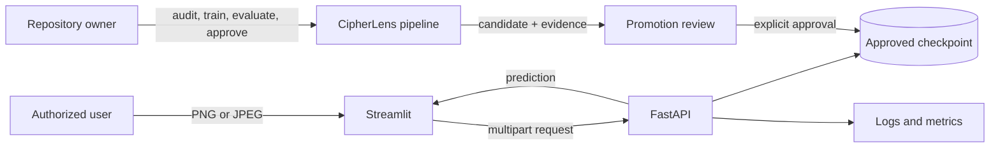
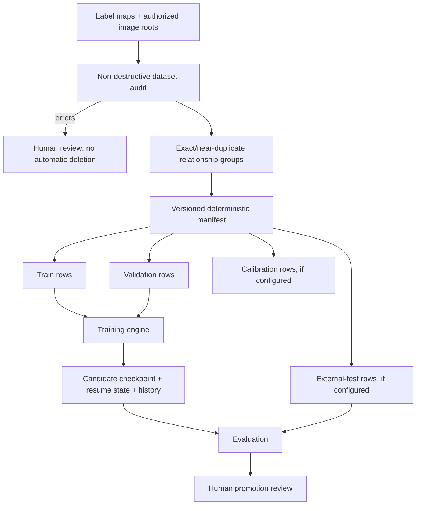
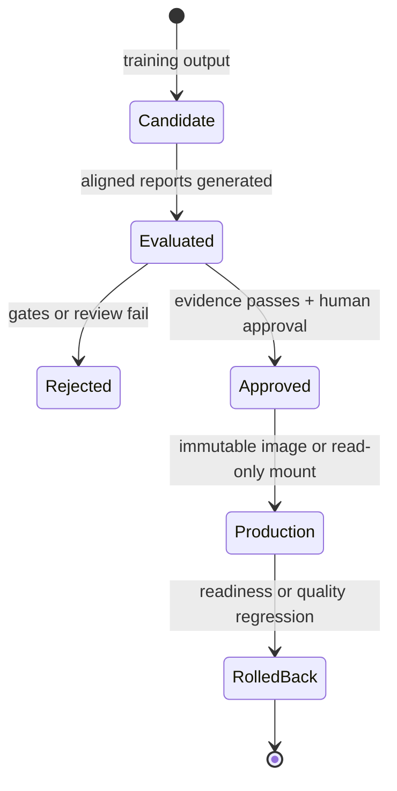
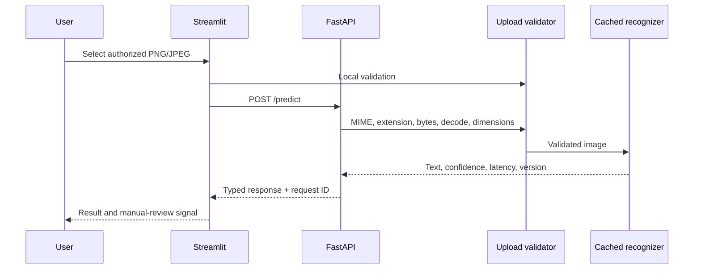
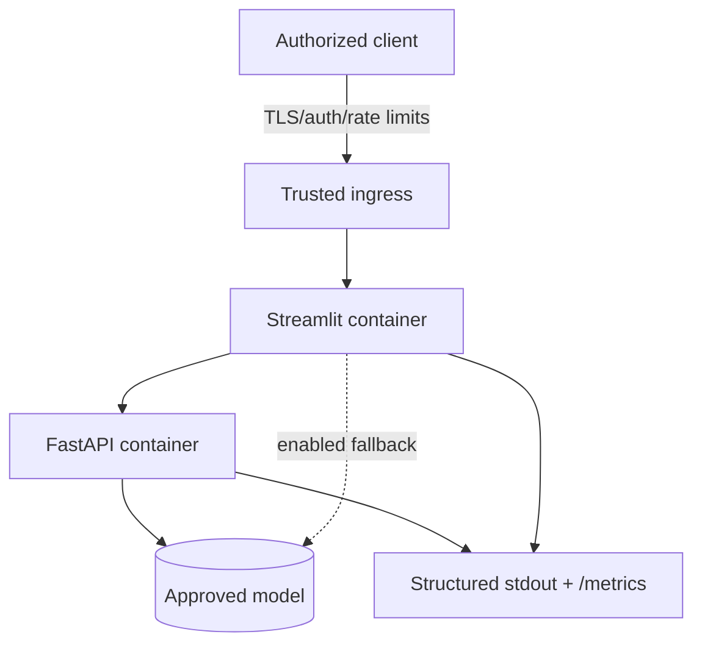

# CipherLens Architecture

## Scope and constraints

CipherLens recognizes exactly six characters in synthetic, owned, or explicitly
authorized CAPTCHA-style images. The design optimizes for a small dataset, CPU
inference, deterministic evidence, and safe local or internal deployment. It does
not include browser automation, CAPTCHA submission, authentication bypass, or
third-party website integration.

Key constraints:

- Python 3.11 is the supported runtime.
- Model V1 is the rollback-safe production baseline.
- Training must never overwrite `models/captcha_crnn.pt`.
- Training, evaluation, serving, and presentation remain separate.
- Training and inference share the same preprocessing contract.
- Uploaded bytes are validated in memory and are not deliberately persisted.
- Metrics describe only their recorded dataset, split, checkpoint, and benchmark.

## System context

The repository owner controls data authorization and model promotion. The runtime
accepts images only; it does not fetch or submit them to another system.

## Component boundaries

| Component | Responsibility | Must not own |
|---|---|---|
| `cipherlens.data` | Dataset audit, manifests, split grouping, preprocessing | Model serving or UI state |
| `cipherlens.models` | V1 position-wise CRNN, codec, optional V2 CTC | Dataset discovery or deployment |
| `cipherlens.training` | Loaders, optimization, resume, checkpoint metadata, tracking | Production model replacement |
| `cipherlens.evaluation` | Metrics, calibration, latency, reports, comparison | Training or automatic promotion |
| `cipherlens.inference` | Restricted checkpoint loading, prediction, API client | HTTP routing or uploaded-file persistence |
| `cipherlens.api` | Startup lifecycle, request validation, typed endpoints, errors | Training code or frontend rendering |
| `cipherlens.monitoring` | Bounded process-local counters and latency summaries | User payload storage |
| `app.py` | Streamlit presentation and local fallback orchestration | Training or external-site automation |
| `configs/` | Validated runtime/training/evaluation defaults and model inventory | Secrets |

Compatibility modules in `src/data.py`, `src/model.py`, `src/inference.py`, and
`src/validation.py` preserve older imports while new code targets `cipherlens.*`.

## Model and preprocessing path

```mermaid
flowchart LR
    A[151 x 41 source image] --> B[Decode and convert RGB]
    B --> C[Resize to 176 x 48]
    C --> D[Normalize pixels to -1 through 1]
    D --> E[4 convolution blocks]
    E --> F[Average feature height]
    F --> G[Bidirectional LSTM]
    G --> H[Adaptive width to 6 steps]
    H --> I[Shared character classifier]
    I --> J[6 x vocabulary logits]
    J --> K[Greedy decode + confidence]
```

Model V1 uses position-wise classification because every target has six
characters. It avoids manual segmentation and blank-token decoding, preserves
repeated characters, and stays compact enough for CPU serving. It is not suitable
for variable-length text without an architectural change.

The checkpoint provides the vocabulary and architecture metadata when available.
The approved legacy checkpoint is loaded with PyTorch's restricted
`weights_only=True` mode and validated before use.

## Training data flow

The audit validates readability, decoded dimensions, label length and vocabulary,
duplicate paths, SHA-256 duplicates, perceptual near-duplicates, and cross-split
leakage. Related samples are grouped before splitting. The current deterministic
manifest contains 800 training and 200 validation rows, with no calibration or
external-test rows.

Training applies restrained augmentation only to training rows. Validation rows
use the inference preprocessing path. The engine uses class-weighted loss, AdamW,
learning-rate reduction, gradient clipping, early stopping, and atomic candidate
checkpoint writes. Resume state includes optimizer, scheduler, early stopping,
history, and serializable random states.

## Evaluation and promotion flow

Evaluation first verifies the requested paths, file hashes, labels, dataset and
split identities, checkpoint vocabulary, and checkpoint SHA-256. It then reports:

- character and exact-string accuracy;
- character error rate and normalized edit distance;
- per-position and per-character metrics;
- failed predictions and confusion matrix;
- sequence confidence, reliability, and expected calibration error;
- warmed-up CPU model-forward latency, parameter count, and artifact size.

Validation, calibration, and external-test roles are not interchangeable. Missing
external evidence is recorded as `pending`; it never becomes a zero or fabricated
score. Temperature scaling is optional and validation-only unless a dedicated
calibration split exists.

Promotion is deliberately manual. Model V1 stays active until a challenger has
aligned, versioned external-test evidence, repeated-run stability, acceptable
accuracy/CER/ECE, bounded latency and model memory, and explicit approval.

## Online inference flow

FastAPI loads one recognizer per process through its application lifecycle. A
bounded semaphore limits concurrent model execution. The upload boundary limits
request bytes, file bytes, file count, decoded pixels, extension, declared MIME,
decoded format, and image integrity.

Every API request receives an `X-Request-ID`. Structured errors expose safe codes
and messages without tracebacks. Logs and metrics contain operational metadata,
not uploaded image bytes or full request bodies.

Streamlit calls the configured API first. It may use the approved local model only
after retryable network or HTTP 5xx failures when fallback is enabled. Client-side
validation errors remain visible and do not trigger fallback.

## Runtime and deployment

`compose.yaml` starts two services from one CPU-only image. The image uses a
multi-stage build and contains runtime dependencies, application code,
configuration, UI assets, and only the approved checkpoint. Training data,
tests, reports, candidates, local configuration, and secrets are excluded.

Both containers:

- run as UID/GID 10001;
- drop all Linux capabilities and enable `no-new-privileges`;
- use a read-only root filesystem and bounded writable `/tmp`;
- receive CPU and memory limits plus graceful `SIGTERM` handling;
- expose service-specific health checks.

The checkpoint can be packaged into an immutable image or supplied through
`compose.model-mount.yaml` as a read-only bind mount. The deployment platform must
add TLS, identity/access control, external rate limiting, image and artifact
signing/scanning, centralized logs/metrics, alerting, and backup policy.

## Health and failure behavior

| Condition | `/health` | `/ready` | UI behavior |
|---|---:|---:|---|
| API process and model available | 200 | 200 | Calls API |
| Missing/invalid checkpoint | 200 | 503 | Compose does not start dependent UI |
| API network/5xx failure | unavailable/5xx | unknown | Optional approved local fallback |
| API rejects upload with 4xx | 200 | normally 200 | Shows structured error; no fallback |

Liveness answers whether the API process can respond; readiness answers whether
the model can serve. Keeping them separate prevents restart loops from hiding a
model-distribution problem while still blocking traffic.

## Configuration hierarchy

1. Typed defaults and validation live in `cipherlens.config`.
2. `configs/default.yaml` provides repository defaults.
3. CLI arguments override training/evaluation settings.
4. `CIPHERLENS_*` environment variables override runtime settings.
5. `.env` is a local Compose convenience only and is ignored by Git.

Invalid configuration fails early with a field-specific error. Secrets are not
part of the application configuration contract.

## Architectural decisions

### Retain the fixed-length CRNN

The current dataset is small and fixed-length, Model V1 is compact, and it is the
only model with measured repository evidence. A variable-length CTC experiment is
isolated as Model V2, but no candidate is committed. Transformer OCR is deferred
until data volume, independent evaluation, and measured benefit justify it.

### Preserve compatibility during modularization

The top-level entry points and `src.*` imports remain operational. This made the
upgrade reviewable and reduced the chance of breaking the approved checkpoint or
Streamlit workflow.

### Separate the frontend from serving

FastAPI owns the model-serving boundary and validation contract. Streamlit owns
presentation. This supports independent health checks, API integration tests, and
future clients without putting training code in either runtime.

### Prefer explicit evidence over automatic promotion

Dataset, split, checkpoint, and report identities are versioned. Promotion stays
manual because a metric from one development split cannot establish external
generalization or authorization.

## Source map

| Concern | Primary files |
|---|---|
| Configuration | `configs/default.yaml`, `src/cipherlens/config.py` |
| Dataset and preprocessing | `src/cipherlens/data/`, `scripts/audit_dataset.py` |
| Model definitions | `src/cipherlens/models/` |
| Training | `train.py`, `src/cipherlens/training/` |
| Evaluation | `scripts/evaluate_model.py`, `src/cipherlens/evaluation/` |
| Serving | `src/cipherlens/api/`, `src/cipherlens/inference/` |
| Frontend | `app.py` |
| Deployment | `Dockerfile`, `compose.yaml`, `compose.model-mount.yaml` |
| Verification | `tests/`, `scripts/verify_runtime.py`, `.github/workflows/ci.yml` |

See the [Dataset Card](dataset-card.md), [Model Card](model-card.md), and
[Operations Guide](operations.md) for evidence and runbooks.
